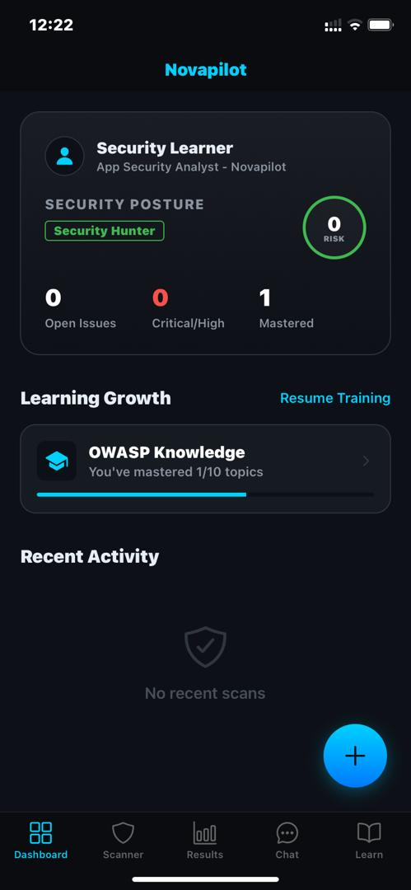
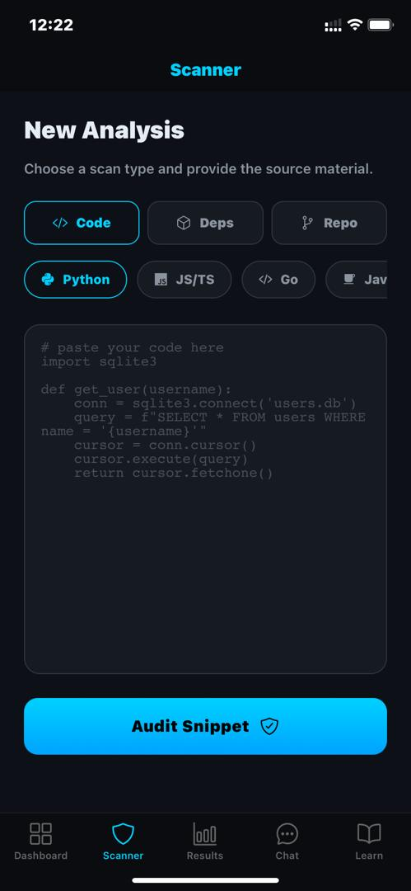
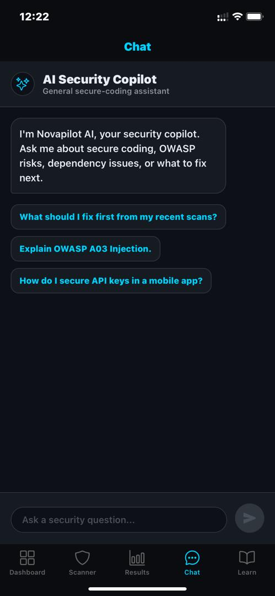
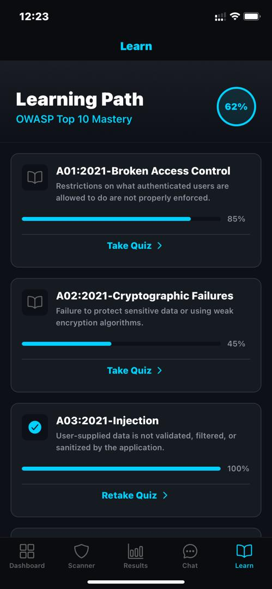

# Novapilot

AI-assisted secure coding companion with a FastAPI backend and Expo mobile app.

## App Preview

| Dashboard | Scanner |
|---|---|
|  |  |

| AI Security Copilot | Learning Path |
|---|---|
|  |  |

## What It Does

- Provides a one-tap competition demo scan.
- Scans pasted source code with Semgrep and AI enrichment.
- Stores scan history locally for dashboard trend views.
- Supports follow-up security chat for individual findings.
- Adds an app-wide AI Security Copilot chat tab.
- Runs dependency checks against OSV.dev.
- Scans GitHub repositories for Python security findings.
- Generates attack walkthroughs, secure rewrite suggestions, and Markdown reports.
- Includes an OWASP learning path and lightweight local user profile.
- Ships with Render and Docker deployment configuration for the backend.

## Project Layout

```text
mobile-app/                 Expo React Native app
owaspilot_backend/backend/  FastAPI backend
```

## Backend Setup

```bash
cd owaspilot_backend/backend
python -m venv .venv
.venv\Scripts\activate
pip install -r requirements.txt
copy .env.example .env
uvicorn main:app --reload
```

The API runs at `http://localhost:8000`.

Optional environment variables:

```text
ANTHROPIC_API_KEY=
OPENAI_API_KEY=
```

Without an AI key, Semgrep still runs and advanced AI endpoints return useful fallback responses.

## Competition Demo

Open the mobile app, go to **Scanner**, and use the **Competition Demo** panel. **Load** fills in a vulnerable sample, and **Run** opens a complete prebuilt scan result for fast judging.

See `COMPETITION.md` for the full demo script.

## Hosted Backend

Render deployment is configured in `render.yaml`.

```bash
git push
```

Then create a Render Blueprint from this repo and set `EXPO_PUBLIC_API_URL` in `mobile-app/.env` to the hosted API URL:

```text
EXPO_PUBLIC_API_URL=https://YOUR_RENDER_SERVICE.onrender.com/api
```

Docker is also supported:

```bash
cd owaspilot_backend/backend
docker build -t novapilot-api .
docker run -p 8000:8000 --env-file .env novapilot-api
```

## Mobile Setup

```bash
cd mobile-app
npm install
copy .env.example .env
npm run start
```

If testing on a physical device, set `EXPO_PUBLIC_API_URL` to your computer's LAN address, for example:

```text
EXPO_PUBLIC_API_URL=http://192.168.1.20:8000/api
```

## Useful Commands

```bash
cd mobile-app
npm run typecheck
```

```bash
cd owaspilot_backend/backend
python -m pytest
```

## API Endpoints

- `GET /api/health`
- `POST /api/scan`
- `GET /api/history`
- `POST /api/chat`
- `POST /api/assistant-chat`
- `POST /api/attack-simulate`
- `POST /api/repo-scan`
- `POST /api/dep-scan`
- `POST /api/rewrite`
- `POST /api/report`
